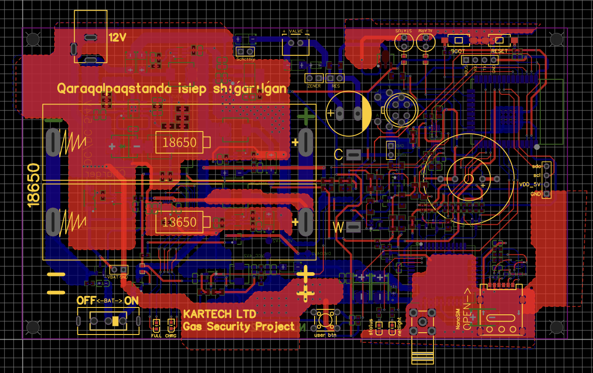
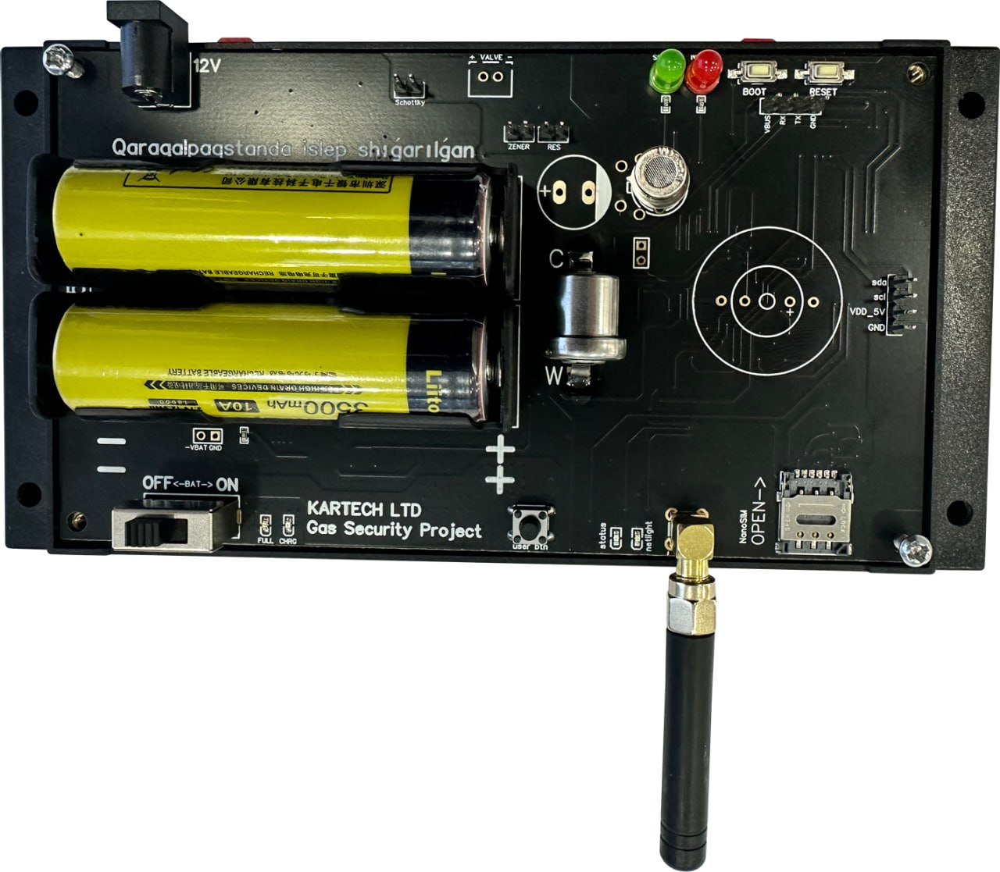
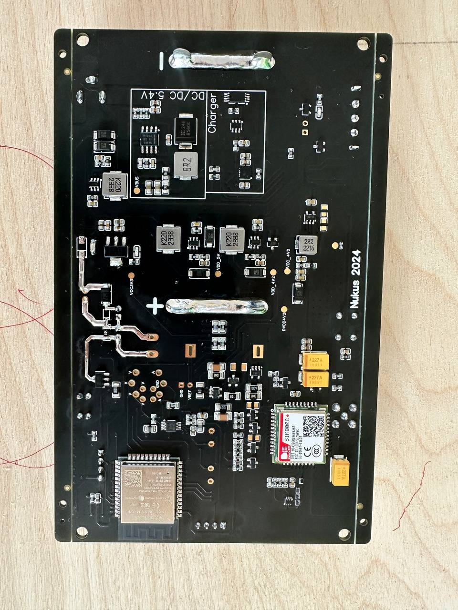
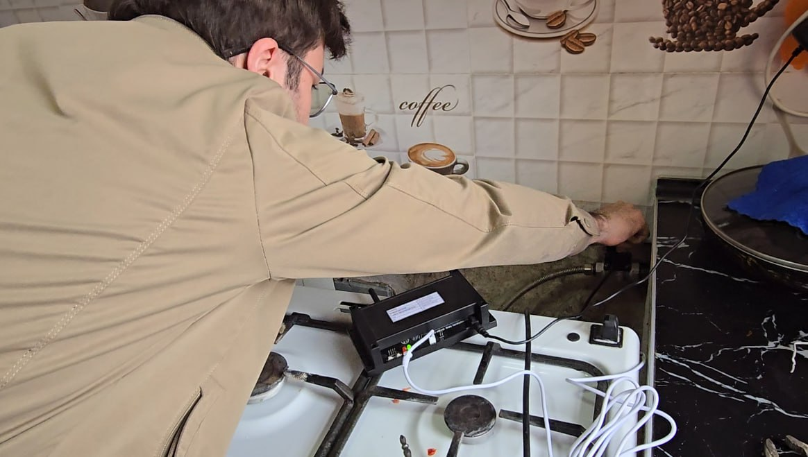

# Gas Security System

A comprehensive gas detection and alert system built on ESP32 that monitors for hazardous gas leaks, particularly methane/propane (CH4) and carbon monoxide (CO). When dangerous gas levels are detected, the system sends SMS alerts and activates safety measures.

## Features

- **Real-time Gas Detection**: Continuously monitors for methane/propane (CH4) and carbon monoxide (CO) using high-precision ADC sensors
- **Automatic Alert System**: Sends SMS notifications when dangerous gas levels are detected
- **Hardware Control**: Automatically triggers safety measures like valve control
- **Visual & Audio Alerts**: Built-in LED indicators and buzzer for local notifications
- **OLED Display**: Shows current gas readings and system status
- **GSM Connectivity**: Uses SIM800 modem for cellular connectivity and SMS alerts
- **User Configuration**: Basic HTTP server for device configuration
- **Battery Monitoring**: Monitors power supply status

## Hardware Components

- ESP32 microcontroller
- ADS111x 16-bit precision ADC for gas sensor readings
- SSD1306 OLED display for status information
- SIM800 GSM modem for cellular connectivity
- Gas sensors for CH4 (methane/propane) and CO (carbon monoxide)
- Safety valve control system
- Status LEDs and buzzer for alerts
- Buttons for testing and configuration

## Pin Configuration

- **VALVE**: GPIO 12
- **BUZZER**: GPIO 16
- **SIM800_PWKEY**: GPIO 5
- **SIM800_POWER**: GPIO 23
- **RED_LED**: GPIO 13
- **GREEN_LED**: GPIO 15
- **ADS111x I2C**: SDA (GPIO 21), SCL (GPIO 22)
- **SIM800 UART**: TX (GPIO 27), RX (GPIO 26)

## Getting Started

### Prerequisites

- ESP-IDF v4.4 or newer
- ESP32 development board
- Required hardware components as listed above

### Building and Flashing

1. Clone this repository
2. Configure project:
   ```
   idf.py menuconfig
   ```
3. Build the project:
   ```
   idf.py build
   ```
4. Flash to your ESP32:
   ```
   idf.py -p [PORT] flash
   ```
5. Monitor output:
   ```
   idf.py -p [PORT] monitor
   ```

## Configuration

The system uses the following default configuration:

- GSM APN: "internet.beeline.uz"
- Default phone number for alerts: +998901289515 (configurable)
- Critical gas thresholds:
  - CH4 (methane/propane): 4.0
  - CO (carbon monoxide): 4.0

## Software Architecture

The software uses FreeRTOS for task management with the following main components:

- **Gas Detection Task**: Continuously reads and analyzes gas sensor values
- **Dispatcher Task**: Handles alerts and notification system
- **SMS Task**: Manages GSM modem for sending alerts
- **HTTP Server**: Provides a web interface for configuration

## Hardware Design

The Gas Security System includes custom hardware design for reliability and compact installation.

### PCB Design

The custom PCB integrates all system components including the ESP32, sensors, and communication modules:


*PCB design created in EasyEDA with component placement and routing*

### PCB Implementation

Front and back view of the manufactured PCB:

<table>
  <tr>
    <td></td>
    <td></td>
  </tr>
  <tr>
    <td>Front view of the assembled PCB showing the ESP32, display, and connector layout</td>
    <td>Back view of the PCB with the SIM800 modem and additional components</td>
  </tr>
</table>

### Installation

The system is designed for easy installation in residential or commercial buildings:


*Example of the gas detector system installed with proper sensor placement*

### Schematic

The complete electrical schematic is available as a PDF:

[View Full Schematic](main/schematic.pdf)
*Detailed electrical connections and component specifications*

## License

This project is licensed under the [MIT License](LICENSE).

## Contributing

Contributions are welcome! Please feel free to submit a Pull Request.